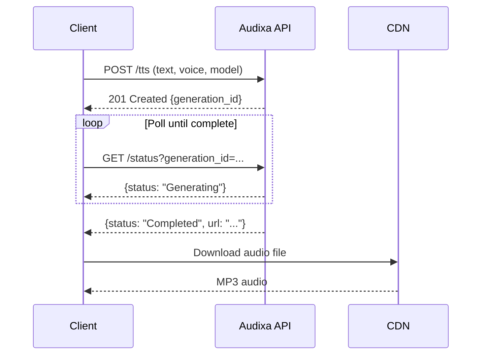

Welcome to the Audixa API Reference. This section provides detailed documentation for all API endpoints.

## Base URL

All API requests are made to:

```
https://api.audixa.ai/v2
```

## Authentication

All endpoints require authentication via the `x-api-key` header:

```bash
-H "x-api-key: YOUR_API_KEY"
```

<Card title="Learn More" icon="key" href="/guides/authentication">
  See the Authentication guide for details on obtaining and using API keys.
</Card>

## Async Workflow

Audixa uses an **asynchronous workflow** for audio generation:



<Steps>
  <Step title="Submit TTS Request">
    POST to `/tts` with your text, voice, and model. Receive a `generation_id`.
  </Step>
  <Step title="Poll Status">
    GET `/status` with your `generation_id` until status is `Completed`.
  </Step>
  <Step title="Download Audio">
    Fetch the audio file from the returned `url`.
  </Step>
</Steps>

## Available Endpoints

<CardGroup cols={3}>
  <Card title="POST /tts" icon="play" href="/api-reference/tts">
    Start a text-to-speech generation job.
  </Card>
  <Card title="GET /status" icon="clock" href="/api-reference/status">
    Check the status of a generation job.
  </Card>
  <Card title="GET /voices" icon="users" href="/api-reference/voices">
    List available voices for a model.
  </Card>
</CardGroup>

## Response Format

All responses are JSON. Successful responses return status `2xx` with the requested data.

**Success example:**
```json
{
  "generation_id": "gen_abc123xyz789"
}
```

**Error example:**
```json
{
  "detail": "Error message explaining what went wrong"
}
```

## Quick Links

<CardGroup cols={2}>
  <Card title="Quickstart" icon="rocket" href="/quickstart">
    Get your first audio in 5 minutes.
  </Card>
  <Card title="Error Codes" icon="circle-exclamation" href="/guides/error-codes">
    Understand and handle API errors.
  </Card>
  <Card title="Rate Limits" icon="gauge" href="/guides/rate-limits">
    Learn about request limits and best practices.
  </Card>
  <Card title="Pricing" icon="coins" href="/guides/pricing-credits">
    Understand credit-based billing.
  </Card>
</CardGroup>
